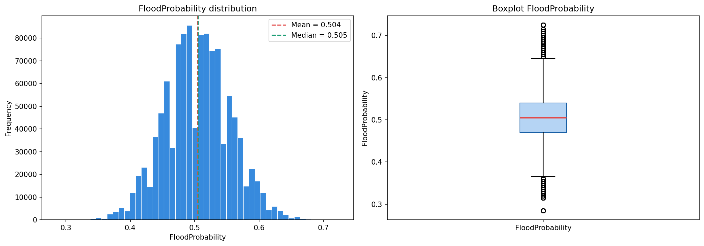
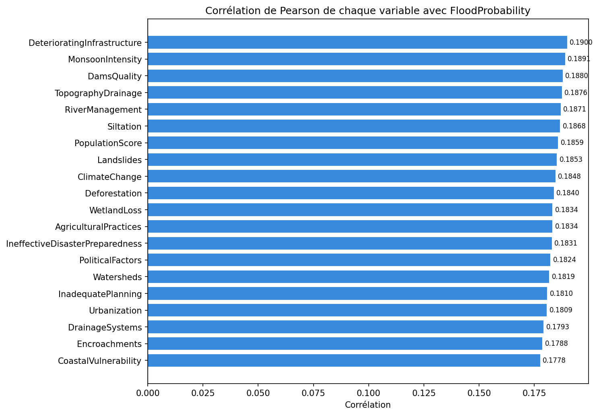
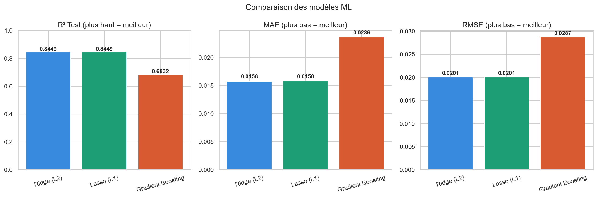

#  Flood Prediction — Machine Learning Project

## Présentation du projet

Ce projet vise à **prédire la probabilité d'inondation** d'une zone géographique à partir de 20 variables environnementales, climatiques et socio-économiques.

---

## 🗂️ Structure du projet

```
flood-prediction-ama/
│
├── notebooks/
│   ├── 01_exploration.ipynb       # Analyse exploratoire des données (EDA)
│   └── 02_modelisation.ipynb      # Entraînement et évaluation des modèles
│
├── src/
│   └── utils.py                   # Fonctions réutilisables
│
├── plots/                         # Graphiques générés automatiquement
├── data/                          # Données locales (non versionnées)
├── requirements.txt               # Dépendances Python
├── .gitignore
└── README.md
```

---

##  Dataset

- **Source** : [Kaggle Playground Series S4E5](https://www.kaggle.com/competitions/playground-series-s4e5/data)
- **Taille** : 1 117 957 lignes × 21 colonnes
- **Cible** : `FloodProbability` (valeur continue entre 0 et 1)
- **Type de problème** : Régression supervisée
- **Valeurs manquantes** : Aucune

### Variables explicatives (features)

| Variable | Description |
|---|---|
| `MonsoonIntensity` | Intensité des pluies de mousson |
| `TopographyDrainage` | Capacité de drainage du terrain |
| `RiverManagement` | Qualité de gestion des cours d'eau |
| `Deforestation` | Niveau de déforestation |
| `Urbanization` | Degré d'urbanisation |
| `ClimateChange` | Impact des changements climatiques |
| `DamsQuality` | Qualité des barrages |
| `Siltation` | Niveau d'envasement |
| `AgriculturalPractices` | Pratiques agricoles |
| `Encroachments` | Empiétements sur zones inondables |
| `IneffectiveDisasterPreparedness` | Manque de préparation aux catastrophes |
| `DrainageSystems` | Qualité des systèmes de drainage |
| `CoastalVulnerability` | Vulnérabilité côtière |
| `Landslides` | Risque de glissements de terrain |
| `Watersheds` | État des bassins versants |
| `DeterioratingInfrastructure` | Dégradation des infrastructures |
| `PopulationScore` | Densité de population |
| `WetlandLoss` | Perte de zones humides |
| `InadequatePlanning` | Insuffisance de planification urbaine |
| `PoliticalFactors` | Facteurs politiques |

---

## Modèles testés & Résultats

| Modèle | R² Test | MAE | RMSE | Temps |
|---|---|---|---|---|
| **Ridge (L2)**  | **0.8449** | **0.0158** | **0.0201** | 0.6s |
| **Lasso (L1)** | **0.8449** | **0.0158** | **0.0201** | 0.6s |
| Gradient Boosting | 0.6832 | 0.0236 | 0.0287 | 234s |

> **Meilleur modèle : Ridge Regression** avec un R² de 0.8449 — 98.4% des prédictions ont une erreur < 0.05

---

## Installation & Utilisation

### 1. Cloner le dépôt

```bash
git clone https://github.com/JusteAgbo05/flood_prediction.git
cd flood-prediction
```

### 2. Installer les dépendances

```bash
pip install -r requirements.txt
```

### 3. Télécharger les données

Télécharge `train.csv` depuis [Kaggle S4E5](https://www.kaggle.com/competitions/playground-series-s4e5/data) et place-le dans le dossier `data/`.

### 4. Lancer les notebooks

```bash
jupyter notebook
```

Ouvre ensuite `notebooks/01_exploration.ipynb` puis `notebooks/02_modelisation.ipynb`.

---

## Résultats visuels

| Distribution de la cible | Corrélations | Comparaison modèles |
|---|---|---|
|  |  |  |

---

##  Observations clés

- Les relations entre les variables et la cible sont **linéaires** → Ridge et Lasso excellent
- Toutes les variables ont une corrélation similaire (~0.18) → le modèle doit les **combiner**
- Le dataset est parfaitement **équilibré** (aucune valeur manquante, distribution symétrique)

---

## 🚀Prochaines étapes

- [ ] Tuning des hyperparamètres (GridSearchCV)
- [ ] Feature Engineering (nouvelles variables combinées)
- [ ] Test de XGBoost / LightGBM
- [ ] Déploiement du modèle (API Flask ou Streamlit)

---

##  Auteur

**[Juste & Agbo]**  
Étudiant en pleine reconversion en développement fullstack et le machine learning 

[](https://www.kaggle.com/competitions/playground-series-s4e5)
